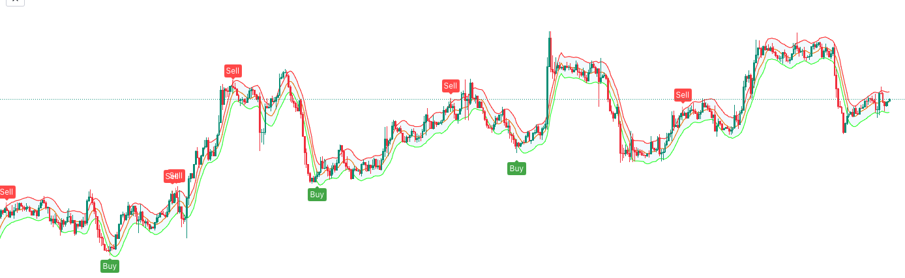

# TradingBot

Demo - https://www.youtube.com/watch?v=86W9DY49nLY
This trading bot opens long or short positions with stopLoss and takeProfit orders.

# Integration

This trading bot is integrated with:

1. TradingView - https://www.tradingview.com/
2. InteractiveBrokers - https://www.interactivebrokers.com
3. Kraken - https://www.kraken.com

# Logic

TradingView sends email when to open a short or long position


email payload:

```json
{
  "position": "long",
  "pair": "{{ticker}}",
  "time": "15 mins",
  "stopLossCanldes": 3,
  "maxStopLoss": 0.02,
  "takeProfitRatio": 1.5,
  "AlertPrice": "{{close}}",
  "AlertTime": "{{timenow}}"
}
```

Then python code checks email and executus real time orders on brokers.
Kraken brokers is for crypto trades. Interactive brokers - forex, stocks

# Setup

You need to define credentials in ./credentials.py. E.g ./credentials.samle.py

# Tests

There are 39 unit tests and 8 integration tests. run tests `python3 main.py test`

# Instalation

- pip install ib_insync
- pip install DateTime
- pip install json
- pip install time
- pip install unittest
- pip install imaplib
- pip install sys
